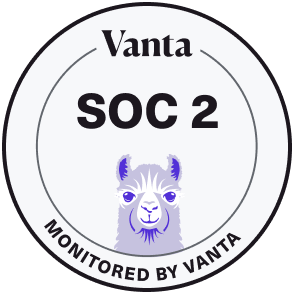
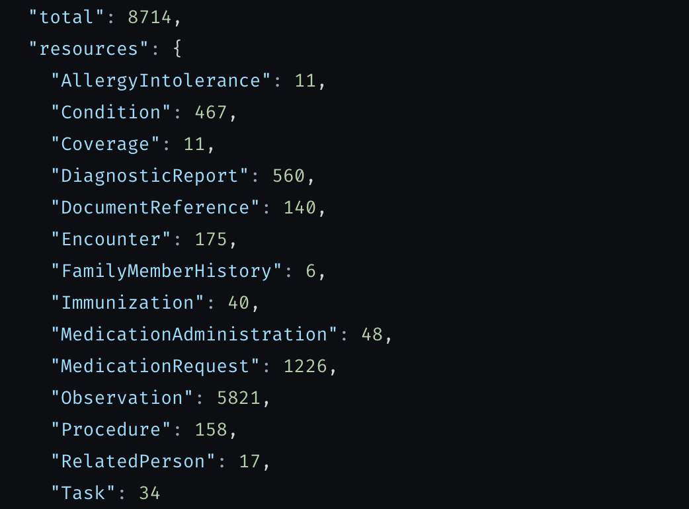
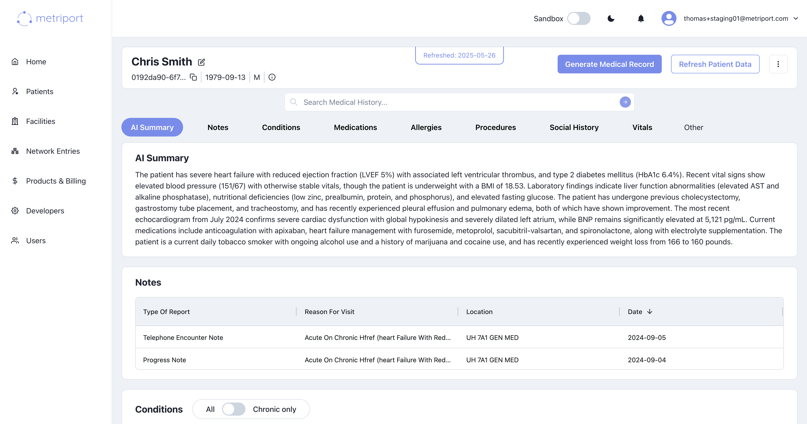

<p align="center">
  <a href="https://github.com/metriport/metriport">
    
  </a>

  <p align="center">
    Metriport helps healthcare organizations access comprehensive patient medical data, through an
    open-source universal API.
    <br />
    <a href="https://metriport.com" target="_blank"><strong>Learn more »</strong></a>
    <br />
    <br />
    <a href="https://docs.metriport.com/" target="_blank">Docs</a>
    ·
    <a href="https://www.npmjs.com/package/@metriport/api-sdk" target="_blank">NPM</a>
    ·
    <a href="https://dash.metriport.com" target="_blank">Developer Dashboard</a>
    ·
    <a href="https://metriport.com" target="_blank">Website</a>

  </p>
</p>

<p align="center">
   <a href="https://status.metriport.com/"></a>
   <a href="https://github.com/metriport/metriport/stargazers"></a>
   <a href="https://github.com/metriport/metriport/blob/master/LICENSE"></a>
   <a href="https://github.com/metriport/metriport/pulse"></a>
   <a href="https://twitter.com/metriport"></a>
   <a href="https://www.linkedin.com/company/metriport"></a>
   <a href="https://www.ycombinator.com/companies/metriport"></a>
</p>

<div align="center">

#### Support us on [Product Hunt](https://www.producthunt.com/products/metriport-api) and [Launch YC](https://www.ycombinator.com/launches/Ghx-metriport-universal-api-for-healthcare-data)

<a href="https://www.producthunt.com/posts/metriport-health-devices-api?utm_source=badge-featured&utm_medium=badge&utm_souce=badge-metriport&#0045;health&#0045;devices&#0045;api" target="_blank"></a> <a href='https://www.ycombinator.com/launches/Ghx-metriport-universal-api-for-healthcare-data' target="_blank"></a>

</div>

## **Overview**

<div>
    <a href="https://www.loom.com/share/c5c049d2f0444e1ea8e075640077a77f">
      <p>Check out our platform demo:</p>
    </a>
    <a href="https://www.loom.com/share/c5c049d2f0444e1ea8e075640077a77f">
      
    </a>
  </div>

## **Security and Privacy**

Metriport is SOC 2 and HIPAA compliant. [Click here](https://metriport.com/security/) to learn more about our security practices.

<p float="left">
  
  
  
  
</p>

### **Medical API**

<div align="center">
   
</div>

Our [Medical API](https://www.metriport.com/medical) brings you data from the largest clinical data networks in the country - one open-source API, 300+ million patients.

Metriport ensures clinical accuracy and completeness of medical information, with HL7 FHIR, C-CDA, and PDF formats supported. Through standardizing, de-duplicating, consolidating, and hydrating data with medical code crosswalking, Metriport delivers rich and comprehensive patient data at the point-of-care.

### **Medical Dashboard**

<div align="center">
   
</div>

Our [Medical Dashboard](https://www.metriport.com/dashboard) enables providers to streamline their patient record retrieval process. Get up and running within minutes, accessing the largest health information networks in the country through a user-friendly interface.

Tools like our FHIR explorer and PDF converter help you make sense of the data you need to make relevant care decisions and improve patient outcomes.

## **Getting Started**

Check out the links below to get started with Metriport in minutes!

### **[Quickstart Guide](https://docs.metriport.com/medical-api/getting-started/quickstart) 🚀**

### **[Developer Dashboard](https://dash.metriport.com/) 💻**

### **[npm package](https://www.npmjs.com/package/@metriport/api-sdk)**

## **Repo Rundown**

### **API Server**

Backend for the Metriport API.

- Dir: [`/api`](/api)
- URL: [https://api.metriport.com/](https://api.metriport.com/)
- Sandbox URL: [https://api.sandbox.metriport.com/](https://api.sandbox.metriport.com/)

### **Infrastructure as Code**

We use AWS CDK as IaC.

- Dir: [`/infra`](/infra)

### **Docs**

Our beautiful developer documentation, powered by [mintlify](https://mintlify.com/) ❤️.

- Dir: [`/docs`](/docs)
- URL: [https://docs.metriport.com/](https://docs.metriport.com/getting-started/introduction)

### **Packages**

Checkout our packages in [`/pkgs`](/pkgs) to help you turbocharge your development:

#### **npm**

Our npm packages are available in [`/packages`](/packages):

- [Metriport API](/packages/api-sdk/): contains the Metriport data models, and a convenient API client wrapper.
- [CommonWell JWT Maker](/packages/commonwell-jwt-maker/): CLI to create a JWT for use in [CommonWell](https://www.commonwellalliance.org/) queries.
- [CommonWell SDK](/packages/commonwell-sdk/): SDK to simplify CommonWell API integration.

---

## **Prerequisites**

Before getting started with the deployment or any development, ensure you have done the following:

1. Install the prerequisite programs:
   - [The latest LTS Node.js version](https://nodejs.org/en/download/).
   - [Docker Desktop](https://www.docker.com/products/docker-desktop/).
   - (Optional) [VS Code](https://code.visualstudio.com/) - recommended IDE.
   - (Optional) [DBeaver](https://dbeaver.io/) - recommended universal DB tool.
2. Create an AWS account.
3. Create an [AWS IAM admin user](https://docs.aws.amazon.com/IAM/latest/UserGuide/getting-started_create-admin-group.html).
4. Setup AWS `Route 53` to [handle the DNS for your domain, and create a hosted zone](https://docs.aws.amazon.com/Route53/latest/DeveloperGuide/migrate-dns-domain-inactive.html).
5. Follow modules 1 & 2 of [this guide](https://aws.amazon.com/getting-started/guides/setup-cdk/) for `Typescript` to bootstrap the `AWS CDK` on your local machine.
6. 🥳 🎉 🥳 🎉 🥳 🎉

## **Local Development**

### Monorepo

This monorepo uses [npm workspaces](https://docs.npmjs.com/cli/v9/using-npm/workspaces) to manage the packages and execute commands globally.

But not all folders under `/packages` are part of the workspace. To see the ones that are, check the
root folder's `package.json` under the `workspaces` section.

To setup this repository for local development, issue this command on the root folder:

```shell
$ npm run init # only needs to be run once
$ npm run build # packages depend on each other, so its best to build/compile them all
```

Useful commands:

- `npm run test`: it executes the `test` script on all workspaces;
- `npm run typecheck`: it will run `typecheck` on all workspaces, which checks for typescript compilation/syntax issues;
- `npm run lint-fix`: it will run `lint-fix` on all workspaces, which checks for linting issues and automatically fixes the issues it can;
- `npm run prettier-fix`: it will run `prettier-fix` on all workspaces, which checks for formatting issues and automatically fixes the issues it can;

### Semantic version

This repo uses [Semantic Version](https://semver.org/), and we automate the versioning by using [Conventional Commits](https://www.conventionalcommits.org/en/v1.0.0/).

This means all commit messages must be created following a certain standard:

```
<type>[optional scope]: <description>
[optional body]
[optional footer(s)]
```

To enforce commits follow this pattern, we have a Git hook (using [Husky](https://github.com/typicode/husky)) that verifies commit messages according to the Conventional Commits -
it uses [commitlint](https://github.com/conventional-changelog/commitlint) under the hood ([config](https://github.com/conventional-changelog/commitlint/tree/master/@commitlint/config-conventional)).

Accepted types:

- build
- chore
- ci
- docs
- feat
- fix
- perf
- refactor
- revert
- style
- test

Scope is optional, and we can use one of these, or empty (no scope):

- api
<!-- - widget -->
- infra

The footer should have the ticket number supporting the commit:

```
...
Ref: #<ticket-number>
```

#### Commitizen

One can enter the commit message manually and have `commitlint` check its content, or use [Commitizen](https://github.com/commitizen/cz-cli)'s
CLI to guide through building the commit message:

```shell
$ npm run commit
```

In case something goes wrong after you prepare the commit message and you want to retry it after fixing the issue, you can issue this command:

```shell
$ npm run commit -- --retry
```

Commitizen will retry the last commit message you prepared previously. More about this [here](https://github.com/commitizen/cz-cli#retrying-failed-commits).

### Security

To avoid pushing secrets to the remote git repository we use [Gitleaks](https://github.com/gitleaks/gitleaks) - triggered by [Husky](https://github.com/typicode/husky).

From their repository:

> Gitleaks is a SAST tool for detecting and preventing hardcoded secrets like passwords, api keys, and tokens in git repos.

It automaticaly scans new commits and interrupts the execution if it finds content that match the configured rules.

Example of report while trying to commit changes:

```shell
> metriport@1.0.0 check-secrets
> docker run --rm -v $(pwd):/path zricethezav/gitleaks:v8.17.0 protect --source='/path' --staged --no-banner -v

Finding:     ...XXXXXXXXXAIXXXXXXXXXXXXXXX/aXXXXXXX...
Secret:      XXXXXXXXXXXXXX
RuleID:      aws-access-token
Entropy:     1.021928
File:        packages/core/src/external/cda/__tests__/examples.ts
Line:        69
Fingerprint: packages/core/src/external/cda/__tests__/examples.ts:aws-access-token:69

2:31AM INF 1 commits scanned.
2:31AM INF scan completed in 141ms
2:31AM WRN leaks found: 1
husky - pre-commit hook exited with code 1 (error)
```

If you're absolutely sure there's no secret on the reported file/line, add the fingerprint to `.gitleaksignore` file - that will be ignored and you'll be able to commit.

### **API Server**

First, create a local environment file to define your developer keys, and local dev URLs:

```shell
$ touch packages/api/.env
$ echo "LOCAL_ACCOUNT_CXID=<YOUR-TESTING-ACCOUNT-ID>" >> packages/api/.env
$ echo "API_URL=http://localhost:8080" >> packages/api/.env
$ echo "FHIR_SERVER_URL=<FHIR-SERVER-URL>" >> packages/api/.env # optional
```

Additionally, define your System Root [OID](https://en.wikipedia.org/wiki/Object_identifier). This will be the base identifier to represent your system in any medical data you create - such as organizations, facilities, patients, and etc.

Your OID must be registered and assigned by HL7. You can do this [here](http://www.hl7.org/oid/index.cfm).

By default, OIDs in Metriport are managed according to the [recommended standards outlined by HL7](http://www.hl7.org/documentcenter/private/standards/v3/V3_OIDS_R1_INFORM_2011NOV.pdf).

```shell
$ echo "SYSTEM_ROOT_OID=<YOUR-OID>" >> packages/api/.env
```

These envs are specific to CommonWell and are necessary in sending requests to their platform.

```shell
$ echo "CW_TECHNICAL_CONTACT_NAME=<YOUR-SECRET>" >> packages/api/.env
$ echo "CW_TECHNICAL_CONTACT_TITLE=<YOUR-SECRET>" >> packages/api/.env
$ echo "CW_TECHNICAL_CONTACT_EMAIL=<YOUR-SECRET>" >> packages/api/.env
$ echo "CW_TECHNICAL_CONTACT_PHONE=<YOUR-SECRET>" >> packages/api/.env
$ echo "CW_GATEWAY_ENDPOINT=<YOUR-SECRET>" >> packages/api/.env
$ echo "CW_GATEWAY_AUTHORIZATION_SERVER_ENDPOINT=<YOUR-SECRET>" >> packages/api/.env
$ echo "CW_GATEWAY_AUTHORIZATION_CLIENT_ID=<YOUR-SECRET>" >> packages/api/.env
$ echo "CW_GATEWAY_AUTHORIZATION_CLIENT_SECRET=<YOUR-SECRET>" >> packages/api/.env
$ echo "CW_MEMBER_NAME=<YOUR-SECRET>" >> packages/api/.env
$ echo "CW_MEMBER_OID=<YOUR-SECRET>" >> packages/api/.env
$ echo "CW_ORG_MANAGEMENT_PRIVATE_KEY=<YOUR-SECRET>" >> packages/api/.env
$ echo "CW_ORG_MANAGEMENT_CERTIFICATE=<YOUR-SECRET>" >> packages/api/.env
$ echo "CW_MEMBER_PRIVATE_KEY=<YOUR-SECRET>" >> packages/api/.env
$ echo "CW_MEMBER_CERTIFICATE=<YOUR-SECRET>" >> packages/api/.env
```

#### **Optional analytics reporting**

The API server reports analytics to [PostHog](https://posthog.com/). This is optional.

If you want to set it up, add this to the `.env` file:

```shell
$ echo "POST_HOG_API_KEY=<YOUR-API-KEY>" >> packages/api/.env
```

#### **Optional usage report**

The API server reports endpoint usage to an external service. This is optional.

A reachable service that accepts a `POST` request to the informed URL with the payload below is required:

```json
{
  "cxId": "<the account ID>",
  "cxUserId": "<the ID of the user who's data is being requested>"
}
```

If you want to set it up, add this to the `.env` file:

```shell
$ echo "USAGE_URL=<YOUR-URL>" > packages/api/.env
```

#### **Finalizing setting up the API Server**

Then to run the full back-end stack, use docker-compose to lauch a Postgres container, local instance of DynamoDB, and the Node server itself:

```shell
$ cd packages/api
$ npm run start-docker-compose
```

...or, from the root folder...

```shell
$ npm run start-docker-compose -w api
```

Now, the backend services will be available at:

- API Server: `0.0.0/0:8080`
- Postgres: `localhost:5432`
- DynamoDB: `localhost:8000`

Another option is to have the dependency services running with docker compose and the back-end API running as regular NodeJS process (faster
to run and restart); this has the benefit of Docker Desktop managing the services and you likely only need to start the dependencies once.

```shell
$ cd packages/api
$ npm run start-dependencies # might be able run it once
$ npm run dev
```

#### **Database Migrations**

The API Server uses Sequelize as an ORM, and its migration component to update the DB with changes as the application
evolves. It also uses Umzug for programatic migration execution and typing.

When the application runs it automatically executes all migrations located under `src/sequelize/migrations` (in ascending order)
before the code is atually executed.

If you need to undo/revert a migration manually, you can use the CLI, which is a wrapper to Umzug's CLI (still under heavy
development at the time of this writing).

It requires DB credentials on the environment variable `DB_CREDS` (values from `docker-compose.dev.yml`, update as needed):

```shell
$ export DB_CREDS='{"username":"admin","password":"admin","dbname":"db","engine":"postgres","host":"localhost","port":5432}'
```

Run the CLI with:

```shell
$ npm i -g ts-node # only needs to be run once
$ cd packages/api
$ ts-node src/sequelize/cli
```

Alternatively, you can use a shortcut for migrations on local environment:

```shell
$ npm run db-local -- <cmd>
```

> Note: the double dash `--` is required so parameters after it go to sequelize cli; without it, parameters go to `npm`

Umzug's CLI is still in development at the time of this writing, so that's how one uses it:

- it will print the commands being sent to the DB
- followed by the result of the command
- it won't exit by default, you need to `ctrl+c`
- the command `up` executes all outstanding migrations
- the command `down` reverts one migration at a time

To create new migrations:

1. Duplicate a migration file on `./packages/api/src/sequelize/migrations`
2. Rename the new file so the timestamp is close to the current time - it must be unique, migrations are executed in sorting order
3. Edit the migration file to perform the changes you want
   - `up` add changes to the DB (takes it to the new version)
   - `down` rolls back changes from the DB (goes back to the previous version)

#### **Additional stuff**

To do basic UI admin operations on the DynamoDB instance, you can do the following:

```shell
$ npm install -g dynamodb-admin # only needs to be run once
$ npm run ddb-admin # admin console will be available at http://localhost:8001/
```

To kill and clean-up the back-end, hit `CTRL + C` a few times, and run the following from the `packages/api` directory:

```shell
$ docker-compose -f docker-compose.dev.yml down
```

To debug the backend, you can attach a debugger to the running Docker container by launching the `Docker: Attach to Node` configuration in VS Code. Note that this will support hot reloads 🔥🔥!

### Utils

The `./packages/utils` folder contains utilities that help with the development of this and other opensource Metriport projects:

- [mock-webhook](https://github.com/metriport/metriport/blob/develop/packages/utils/src/mock-webhook.ts): implements the Metriport webhook protocol, can be used by applications integrating with Metriport API as a reference to the behavior expected from these applications when using the webhook feature.
- [fhir-uploader](https://github.com/metriport/metriport/blob/develop/packages/utils/src/fhir-uploader.ts): useful to insert synthetic/mock data from [Synthea](https://github.com/synthetichealth/synthea) into [FHIR](https://www.hl7.org/fhir) servers (see https://github.com/metriport/hapi-fhir-jpaserver).

Check the scripts on the folder's [package.json](https://github.com/metriport/metriport/blob/develop/packages/utils/package.json) to see how to run these.

---

### Tests

Unit tests can be executed with:

```shell
$ npm run test
```

To run integration tests, make sure to check each package/folder README for requirements, but in general they can be
executed with:

```shell
$ npm run test:e2e
```

## **Self-Hosted Deployments**

### **API Key Setup**

Most endpoints require an API Gateway [API Key](https://docs.aws.amazon.com/apigateway/latest/developerguide/api-gateway-api-usage-plans.html).
You can do it manually on AWS console or programaticaly through AWS CLI or SDK.

To do it manually:

1. Login to the AWS console;
1. Go to API Gateway;
1. Create a Usage Plan if you don't already have one;
1. Create an API Key;
   - the `value` field must follow this pattern: base 64 of "`<KEY>:<UUID>`", where:
   - `KEY` is a random key (e.g., generated with `nanoid`); and
   - `UUID` is the customer ID (more about this on [Initialization](#initialization))
1. Add the newly created API Key to a Usage Plan.

Now you can make requests to endpoints that require the an API Key by setting the `x-api-key` header.

### **Environment Setup**

1. Install [AWS CLI](https://aws.amazon.com/cli/) and authenticate with it.

2. You'll need to create and configure a deployment config file: `/infra/config/production.ts`. You can see `example.ts` in the same directory
   for a sample of what the end result should look like. Optionally, you can setup config files for `staging` and `sandbox` deployments, based on
   your environment needs. Then, proceed with the deployment steps below.

3. Configure the Connect Widget environment variables to the subdomain and domain you'll be hosting the API at in the config file: `packages/connect-widget/.env.production`.

### **Deployment Steps**

1. First, deploy the secrets stack. This will setup the secret keys required to run the server using AWS Secrets Manager and create other infra
   pre-requisites. To deploy it, run the following commands (with `<config.stackName>` replaced with what you've set in your config file):

```shell
$ ./packages/scripts/deploy-infra.sh -e "production" -s "<config.secretsStackName>"
```

2. After the previous steps are done, define all of the required keys in the AWS console by navigating to the Secrets Manager.

3. Then, to provision the infrastructure needed by the API/back-end execute the following command:

```shell
$ ./packages/scripts/deploy-infra.sh -e "production" -s "<config.stackName>"
```

This will create the infrastructure to run the API, including the ECR repository where the API will be deployed at. Take note of that to populate
the environment variable `ECR_REPO_URI`.

4. To provision the IHE Gateway:

Update the `packages/infra/config/production.ts` configuration file, populating the properties under
`iheGateway` with the information from the respective resources created on the previous step
(API Stack).

Execute:

```shell
$ ./packages/scripts/deploy-infra.sh -e "production" -s "IHEStack"
```

This will create the infrastructure to run the IHE Gateway.

5. To deploy the API on ECR and restart the ECS service to make use of it:

```shell
$ AWS_REGION=xxx ECR_REPO_URI=xxx ECS_CLUSTER=xxx ECS_SERVICE=xxx ./packages/scripts/deploy-api.sh"
```

where:

- ECR_REPO_URI: The URI of the ECR repository to push the Docker image to (created on the previous step)
- AWS_REGION: The AWS region where the API should be deployed at
- ECS_CLUSTER: The ARN of the ECS cluster containing the service to be restarted upon deployment
- ECS_SERVICE: The ARN of the ECS service to be restarted upon deployment

After deployment, the API will be available at the configured subdomain + domain.

Note: if you need help with the `deploy-infra.sh` script at any time, you can run:

```shell
$ ./packages/scripts/deploy-infra.sh -h
```

## License

Distributed under the AGPLv3 License. See `LICENSE` for more information.

Copyright © Metriport 2022-present
