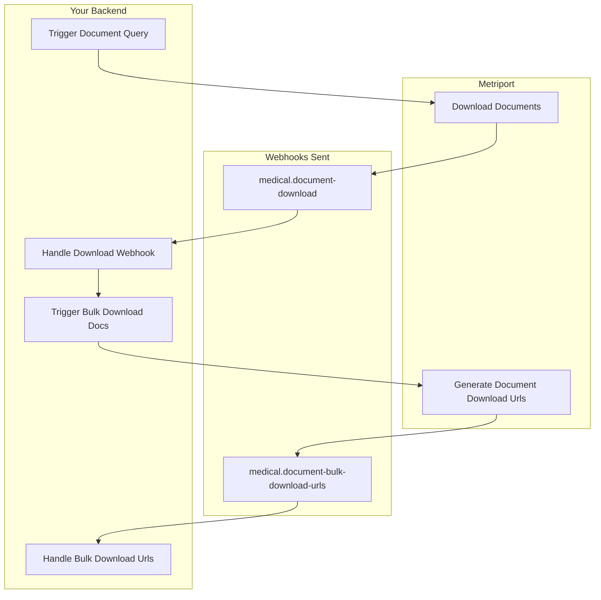
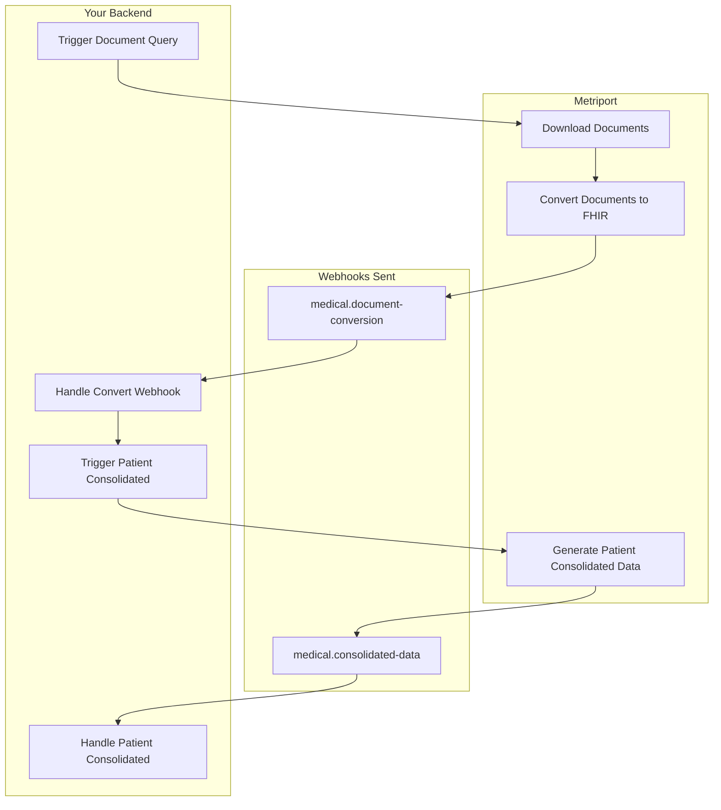

## Overview

When using the Medical API, Metriport will send Webhook messages to your app as soon as data becomes available.

This is the usual flow to obtain Patient data:

1. You trigger a [document query](/medical-api/api-reference/document/start-document-query) to retrieve a Patient's medical documents from HIEs;
   - XML C-CDA documents will be converted and stored on Metriport's FHIR storage;
   - as documents get downloaded and converted, you should get [patient document data](#patient-document-data) webhook messages;
2. Once document conversion is completed, you can [query for patient consolidated data](/medical-api/api-reference/fhir/consolidated-data-query-post);
   - depending on the amount of data this can take some time to crunch together, so results are sent through a webhook message:
     [patient consolidated data](#patient-consolidated-data)

You should expect to get more than one Webhook message per patient per request (document query and/or consolidated data).

To enable this integration approach with Metriport, and for some prerequesite reading to understand
how the Webhook flow works, see [our Webhooks guide](/medical-api/getting-started/webhooks).

<Warning>
  When you receive a webhook message, you should respond
  with a `200` status code within 4 seconds. We recommend
  processing the webhook request asynchronously.
</Warning>

### Types of Messages

- `medical.document-download`: result of Document Query, containing the newly downloaded documents
  for the patient - see [details](#patient-document-data) below;
- `medical.document-conversion`: result of converting the newly downloaded C-CDA documents into FHIR -
  see [details](#patient-document-data) below;
- `medical.document-bulk-download-urls`: list of download urls for a patient's documents, see
  [details](#bulk-document-download-urls) below;
- `medical.consolidated-data`: result of a Consolidated Data Query, containing the patient's data in FHIR
  format - see [details](#patient-consolidated-data) below.
- `medical.bulk-patient-create`: updates for a [Bulk Patient Create](/medical-api/api-reference/patient/bulk-create-patient)
  - see [details](#bulk-patient-create) below.

### Workflow

#### Download URLs

Below is a flowchart of the process to download all the raw documents we've received from the networks for a patient:



#### Consolidated Data

Below is a flowchart of the process to get a patient's consolidated FHIR data:



### Passing Metadata

You can pass metadata to endpoints that support webhooks, and you will receive the `meta.data` field of the webhook request.

Metadata holds a record of up to 50 custom string key-value pairs. Key names can be up to 40 characters long and values up to 500 characters long. You may use this to attach whatever metadata is relevant for your use-case - for example, external IDs.
Below is an example payload you could send in the request body of one of those endpoints and how you would use the sdk:

<Snippet file="webhook-metadata-post-example.mdx" />

<Snippet file="webhook-metadata-sdk-example.mdx" />

### Patient Document Data

These are messages you can expect to receive in the following scenarios:

1. When [queried documents](/medical-api/api-reference/document/start-document-query) have completed
   downloading, the message `type` will be `medical.document-download`, and at this point
   you'll be able to [download the raw files](/medical-api/api-reference/document/get-document);
2. Then, if the downloaded documents contained C-CDA/XML files, when the conversion to FHIR has
   completed, the message `type` will be `medical.document-conversion`, and at this point
   you'll be able to query for [patient consolidated data](/medical-api/api-reference/fhir/consolidated-data-query-post)
   in FHIR-compliant format.

<Tip>
  Note that the webhooks will only contain updates for new
  data fetched in the current document query.
</Tip>

```json
{
  "meta": {
    "messageId": "<message-id>",
    "when": "<date-time-in-utc>",
    "type": "medical.document-download"
    "data": {
        youCan: "putAny",
        stringKeyValue: "pairsHere",
    }
  },
  "patients": [
    {
      "patientId": "eddeefa1-b54a-41d6-854f-0e91b7871d6a",
      "externalId": "1234567890",
      "additionalIds": {
        "athenahealth": ["99992"]
      },
      "type": "document-download",
      "status": "completed",
      "documents": [
        {
          "id": "1.2.543.1.34.1.34.134",
          "fileName": "CCDA_Diag.xml",
          "description": "Patient Diagnoses",
          "status": "current",
          "indexed": "2019-09-07T15:50:00.000Z",
          "mimeType": "application/xml",
          "size": "17344007",
          "type": {
            "coding": [
              {
                "system": "http://snomed.info/sct",
                "code": "62479008",
                "display": "Diagnoses"
              }
            ],
            "text": "Diagnoses"
          }
        },
        {
          "id": "1.2.543.1.224.54.22.540",
          "fileName": "Progress_Notes.xml",
          "description": "Patient Encounter Progress Notes 2023-03-22",
          "status": "current",
          "indexed": "2023-03-22T08:34:00.000Z",
          "mimeType": "application/xml",
          "size": "8675545",
          "type": {
            "coding": [
              {
                "system": "http://snomed.info/sct",
                "code": "371532007",
                "display": "Progress Report"
              }
            ],
            "text": "Progress Notes"
          }
        }
      ]
    },
    {
      "patientId": "<patient-id-2>",
      "type": "document-download",
      "status": "completed",
      ...
    }
  ]
}
```

The format follows:

<ResponseField name="meta" required>
  Metadata about the message. The full format is described [here](/medical-api/getting-started/webhooks#meta-data).

  <Expandable title="meta type property details">

    <ResponseField name="type" type="string" required>
      The type of the Medical API webhook data message. Can be one of: `medical.document-download`, `medical.document-conversion`,
      `medical.consolidated-data`, `medical.document-bulk-download-urls`.
    </ResponseField>

  </Expandable>

</ResponseField>

<ResponseField name="patients" type="PatientDocQueryUpdate[]" required>
  Array of Document query status updates - where each item corresponds to a specific patient.

  <Expandable title="PatientDocQueryUpdate properties">

    <ResponseField name="patientId" type="string" required>
      The Patient ID.
    </ResponseField>

    <ResponseField name="type" type="string" required>
      Specifies what step in the Document query flow this message is for - can be one of
      `document-download` | `document-conversion`.
    </ResponseField>

    <ResponseField name="status" type="string" required>
      The outcome of the step corresponding to `type` - can be one of `completed` | `failed`.
    </ResponseField>

    <ResponseField name="documents" type="DocumentReference[]">
      An array of objects describing the Documents that can be retrieved for the Patient - will only be present for `document-download` messages.
      <Expandable title="DocumentReference properties">
        <Snippet file="document-reference-response.mdx" />
      </Expandable>
    </ResponseField>

  </Expandable>
</ResponseField>

### Patient Consolidated Data

A Patient's consolidated data is the result of converting all C-CDA documents into deduplicated and standardized FHIR, as well as other FHIR data your application
has [inserted into Metriport's FHIR repository](/medical-api/api-reference/fhir/create-patient-consolidated).

This data can be retrieved in either FHIR JSON format, or a rendered PDF or HTML [Medical Record Summary](/medical-api/handling-data/medical-record-summary).

Patients can have a large amount of data, so in order to have access to a Patient's data:

1. [Trigger a consolidated data query](/medical-api/api-reference/fhir/consolidated-data-query-post) - one query per patient at any given time;
1. Your app can check the status by calling [get consolidated query status](/medical-api/api-reference/fhir/consolidated-data-query-get) (optional);
1. When the result is ready, we'll send a webhook message with the results (below).

Note that inside the `Bundle` you'll find a `DocumentReference` resource with the first item in the `content` array containing
an attachment with a `url` which can be used to download the data.

<Info>
  If there was no data available for the Patient, the
  `Bundle` will be empty (the `entry` array will have no
  elements).
</Info>

Example payload:

```json
{
  "meta": {
    "messageId": "1e82424a-1220-473d-a0d1-6e5fde15159e",
    "when": "2023-08-23T22:09:11.373Z",
    "type": "medical.consolidated-data"
  },
  "patients": [
    {
      "patientId": "eddeefa1-b54a-41d6-854f-0e91b7871d6a",
      "externalId": "1234567890",
      "additionalIds": {
        "athenahealth": ["99992"]
      },
      "status": "completed",
      "filters": {
        "resources": "Encounter,Observation"
      },
      "bundle": {
        "resourceType": "Bundle",
        "total": 1,
        "type": "collection",
        "entry": [
          {
            "resource": {
              "resourceType": "DocumentReference",
              "subject": {
                "reference": "Patient/eddeefa1-b54a-41d6-854f-0e91b7871d6a"
              },
              "content": [
                {
                  "attachment": {
                    "contentType": "application/json",
                    "url": "https://documents.s3.amazonaws.com/abc123-Amz-SignedHeaders=host"
                  }
                }
              ]
            }
          }
        ]
      }
    }
  ]
}
```

The format follows:

<ResponseField name="meta" required>
  Metadata about the message. The full format is described [here](/medical-api/getting-started/webhooks#meta-data).

  <Expandable title="meta type property details">

    <ResponseField name="type" type="string" required>
      For Patient Consolidated Data this will always be `medical.consolidated-data`.
    </ResponseField>

  </Expandable>

</ResponseField>

<ResponseField name="patients" type="PatientConsolidatedData[]" required>
  Array of consolidated data query results - where each item corresponds to a specific patient.

  <Expandable title="PatientConsolidatedData properties">

    <ResponseField name="patientId" type="string" required>
      The Patient ID.
    </ResponseField>

    <ResponseField name="status" type="string" required>
      The outcome of consolidated data query - can be one of `completed` | `failed`.
    </ResponseField>

    <ResponseField name="filters" type="Filter[]" required>
      The filters used to obtain the patient's consolidated data.
      <Expandable title="Filter properties">

        <ParamField query="resources" type="string" optional>
          A comma separated, case sensitive list of resources to be returned. If none are provided all
          resources will be included.
        </ParamField>

        <ParamField query="dateFrom" type="string" optional>
          The start date (inclusive) for which to filter returned resources - formatted `YYYY-MM-DD` as per
          ISO 8601. If not provided, no start date filter will be applied.
        </ParamField>

        <ParamField query="dateTo" type="string" optional>
          The end date (inclusive) for which to filter returned resources - formatted `YYYY-MM-DD` as per
          ISO 8601. If not provided, no end date filter will be applied.
        </ParamField>

      </Expandable>
    </ResponseField>

    <ResponseField name="bundle" type="Bundle">
      A FHIR [Bundle](/medical-api/fhir/resources/bundle) containing a `DocumentReference` resource with the first item in the `content` array containing
      an attachment with a `url` which can be used to download the FHIR JSON payload - the `url` is valid for 3 minutes.
    </ResponseField>

  </Expandable>
</ResponseField>

### Bulk Patient Create

During the processing of a [Bulk Patient Create](/medical-api/api-reference/patient/bulk-create-patient),
the Metriport API sends Webhook messages of type `medical.bulk-patient-create` to indicate the status
update and provide relevant information.

You can expect to get two messages of this type for each Bulk Patient Create, with the status
being the main difference between each:

- First message:
  - `processing`: the CSV file has been uploaded and is being processed;
- Second message - one of:
  - `completed`: the bulk create is completed - includes the [result CSV file](#result-csv-file);
  - `failed`: the bulk create failed (likely due to the uploaded file being invalid).

<Info>
  The URL will only be valid for 180 seconds (3 minutes).
</Info>

Example payload:

```json
{
  "meta": {
    "messageId": "00000000-00000000-00000000-00000000",
    "when": "2024-12-30T05:05:12.215Z",
    "type": "medical.bulk-patient-create"
  },
  "bulkPatientCreate": {
    "requestId": "00000000-00000000-00000000-00000000",
    "status": "completed",
    "result": "<presigned-download-url>"
  }
}
```

The format follows:

<ResponseField name="meta" required>
  Metadata about the message. The full format is described
  [here](/medical-api/getting-started/webhooks#meta-data).
  <Expandable title="meta type property details">
    <ResponseField name="type" type="string" required>
      For Bulk Patient Create this will always be
      `medical.bulk-patient-create`.
    </ResponseField>
  </Expandable>
</ResponseField>

<ResponseField name="bulkPatientCreate" type="BulkPatientCreate" required>
  The information about the Bulk Patient Create request.

  <Expandable title="BulkPatientCreate properties">
    <ResponseField name="requestId" type="string" required>
      The ID that represents this bulk patient create.
    </ResponseField>
  
    <ResponseField name="status" type="string" required>
      The status of the bulk create. One of `processing`, `failed`, or `completed`.
      See all the possible values
      [here](/medical-api/api-reference/patient/bulk-create-patient#bulk-patient-create-status).
    </ResponseField>

    <ResponseField name="reason" type="string">
      The reason for a failed bulk create. Only present if the status
      is `failed`.
    </ResponseField>

    <ResponseField name="result" type="string">
      The URL to download the CSV file containing the result of
      the Bulk Patient Create. It's valid for 3 minutes. Only present if the
      status is `completed`.
    </ResponseField>

  </Expandable>
</ResponseField>

#### Result CSV File

The message `medical.bulk-patient-create` with status `completed` includes a URL in the `result`
field, which you can use to download the result of the Bulk Patient Create.

<Info>
  The URL will only be valid for 180 seconds (3 minutes).
</Info>

The file is based on the same format as the
[input CSV](/medical-api/api-reference/patient/bulk-create-patient#input-csv-file-format), with the
following additional columns:

<ParamField body="metriportId" type="string">
  The ID of the Patient on Metriport - only provided if the
  Patient was created successfully.
</ParamField>
<ParamField body="status" type="string" required>
  Whether the respective demographics was accepted and used
  to create a Patient. Can be one of `succeeded` or
  `failed`.
</ParamField>
<ParamField body="reason" type="string">
  If the patient failed to be created, this indictes the
  reason for failure. Only included if the patient fails to
  be created.
</ParamField>

An example of a result file can be accessed
[here](https://docs.google.com/spreadsheets/d/1ojBjxya2l3mTjdZhK5DLY7QTZ9SIIkH9vhnacrftqY4/edit?usp=sharing).

### Bulk Document Download URLs

If you want to download all of a patient's documents, especially when they have a large volume of documents, you can start a [Bulk Get Document URL query](/medical-api/api-reference/document/download-url-bulk). We’ll send a webhook message with all the downloadable URLs for all the patient's documents.
You can use the value of the `url` property in the returned `documents` objects to download the files.

<Info>
  The URLs will only be valid for 600 seconds (10 minutes).
</Info>

Here is an example payload:

```json
{
"meta": {
    "messageId": "bd4184dd-3b35-4c60-8130-447d1d528fea",
    "when": "2023-11-30T05:05:12.215Z",
    "type": "medical.document-bulk-download-urls"
  },
  "patients": [
    {
      "status": "completed",
      "patientId": "eddeefa1-b54a-41d6-854f-0e91b7871d6a",
      "externalId": "1234567890",
      "additionalIds": {
        "athenahealth": ["99992"]
      },
      "documents": [
        {
          "id": "018c1b94-57dc-7950-b564-f74ab9b56cc4",
          "size": 40670,
          "fileName": "81f2ec4e-c71c-4090-bf1c-9d8529f25b5a/018c1b94-2ed9-70f2-8b0f-ad4f8e8c7a16/81f2ec4e-c71c-4090-bf1c-9d8529f65b5a_018c1b94-2ed9-70f2-8b0f-ad4f8e8c7a16_018c1b94-57dc-7950-b564-f74ab9b56cc4.xml",
          "description": "Patient Diagnoses",
          "status": "current",
          "indexed": "2019-09-07T15:50:00.000Z",
          "mimeType": "application/xml",
          "size": 40670,
          "type": {
            "coding": [
              {
                "system": "http://snomed.info/sct",
                "code": "62479008",
                "display": "Diagnoses"
              }
            ],
            "text": "Diagnoses"
          }
          "url": "<a-document-url>"
        },
        {
          "id": "018c1b94-57dc-7950-b564-f749bcf9be3e",
          "fileName": "81f2ec4e-c71c-4090-bf1c-9d8529f25b5a/018c1b94-2ed9-70f2-8b0f-ad4f8e8c7a16/81f2ec4e-c71c-4090-bf1c-9d8529f65b5a_018c1b94-2ed9-70f2-8b0f-ad4f8e8c7a16_018c1b94-57dc-7950-b564-f749bcf9be3e.pdf",
          "description": "Patient Diagnoses",
          "status": "current",
          "indexed": "2019-09-07T15:50:00.000Z",
          "mimeType": "application/pdf",
          "size": 77093,
          "type": {
            "coding": [
              {
                "system": "http://snomed.info/sct",
                "code": "62479008",
                "display": "Diagnoses"
              }
            ],
            "text": "Diagnoses"
          }
          "url": "<another-document-url>"
        }
      ],
    }
  ]
}
```

The format is as follows:

<ResponseField name="meta" required>
  Metadata about the message. The full format is described [here](/medical-api/getting-started/webhooks#meta-data).

  <Expandable title="Details of the 'meta' type property">

    <ResponseField name="type" type="string" required>
      The type of the Medical API webhook data message. In this case, it will be `medical.document-bulk-download-urls`.
    </ResponseField>

  </Expandable>
</ResponseField>

<ResponseField name="patients" type="DocumentBulkDownloadUrls[]" required>
  An array of Document bulk download URLs, where each item corresponds to the queried patient.

  <Expandable title="DocumentBulkDownloadUrl properties">

    <ResponseField name="patientId" type="string" required>
      The Patient ID.
    </ResponseField>

    <ResponseField name="status" type="string" required>
      The outcome of the step corresponding to `type` - can be one of `completed` | `failed`.
    </ResponseField>

    <ResponseField name="documents" type="DocumentReferenceWithURL[]">
      An array of objects describing the Documents that can be retrieved for the Patient along with the downloadable url to retrieve them.
      <Expandable title="DocumentReference properties">
        <Snippet file="document-reference-bulk-document-response.mdx" />
      </Expandable>
    </ResponseField>

  </Expandable>
</ResponseField>
