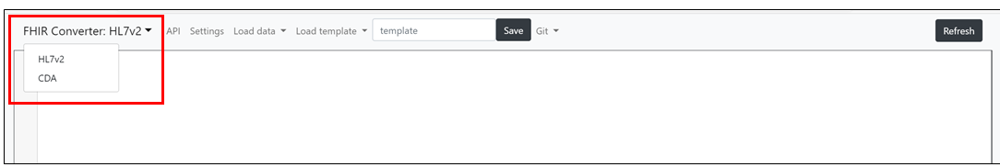

⚠ **This document applies to the Handlebars engine. Follow [this](https://github.com/microsoft/FHIR-Converter/tree/dotliquid) link for the documentation of Liquid engine.**   

# How to create a template

In this how-to guide, we will cover some of the basics around creating templates for converting healthcare data into FHIR bundles. The templates are an implementation of the open-source project [handlebars](https://handlebarsjs.com/). Handlebars compiles templates into JavaScript functions. The handlebars website has the most up to date information and is a great reference as you get into template building.

## Prerequisites

Before starting to create a template, ensure that you have deployed the GitHub code and have a local repository of the existing templates. As part of the code, we have included an optional web editor to assist with modifying and creating templates. You can choose to use this web editor or another code editor. For a high level overview of the features for the web UI, see the [web UI summary](web-ui-summary.md).

## Getting started with templates

The easiest way to create a template is to start with an existing template and modify that template. However, you can also start from scratch to create your template. There are top level templates that can be used to create a FHIR bundle by translating a full HL7 v2 message or CDA document. There are partial templates that are used as building blocks to create the top level template. For more details on the partial templates, see the [partial template concept section](partial-template-concept.md).

To get started editing templates, select the HL7 v2 or C-CDA template editor from the drop down:  

To get started updating/creating templates:

1. Load or paste in the sample data that you are using to validate your template. When modifying and creating templates, it’s helpful to have your sample data loaded so that you are able to see the FHIR results real time as you’re editing.

2. Load your starting template or clear the template editing section. Rename the template and hit save so that your new template work doesn’t overwrite an existing template.

3. As you make updates in the template editor, you will see the results of those reflected in the FHIR output.

**TIP**: When editing templates, auto-completion is available for common scenarios to help you pull in commands, helper functions, and template names. To pull these in, start with {{. If you need to pull a partial template, type {{>.

4. Once you are done editing, make sure to hit save. Your template will now be available to be called by the API for real time data conversion.

For step by step instructions for how to get started updating/creating HL7 v2 templates, see the [HL7v2 Template Creation](template-creation-guide-HL7v2.md).

For step by step instructions for how to get started updating/creating C-CDA templates, see the [C-CDA Template Creation](template-creation-guide-CCDA.md).

### Creating Template best practices

1. Read the [handlebars documentation](https://handlebarsjs.com/guide/) for best practices on handlebars.
1. When creating FHIR resources, you will create a unique URL for each resource leveraging the helper function generateUUID. When you pass in the parameters for this helper function, you should consider what data would drive the same unique URL. For example, for a patient, you may only pass in the MRN to ensure that the unique URL For the patient resource is consistent even if other information like their address changes.
1. In general, it is better to parse data in the top level template and pass individual segment references to partial templates.
1. As part of handlebars, there are some built-in helper functions available to you. The handlebars documentation will have the most up to date information on this.
1. Leveraging partial templates allows you to build building blocks and utilize those building blocks across multiple templates.
1. Helper functions give you additional functionality for parsing the data. See the [helper concept guide](using-helpers-concept.md) for more details.

## Partial templates

Handlebars allows for nested templates, enabling you to create partial templates to be called by your top level template. If you want to edit a referenced partial template, you can double click on any underlined reference in the template editor and that template will open in a new tab . As you make modifications, you will see the results reflected in the FHIR output, which still shows the main top level template you loaded originally.

**NOTE**: When creating a FHIR bundle, it is often required to pull details from several partial templates. When doing this, it is possible that resources could be repeated. To avoid duplicate entries, once the data has been compiled, the FHIR Converter will merge/de-dup any created resources that have the same resourceType, ID, and versionID. An example of a template leveraging this is ADT_A01.hbs.

While you’re modifying a partial template, decide if you want to modify the partial template for all templates that reference this partial template or just the one you’re working on. If you only want to modify it for the one template you are working on, make sure to rename the template at the top before making any changes and hit save. On the main template you will have to update the template to call your newly named partial template.

For more details on the released partial templates and examples, see the [Partial Templates concept](partial-template-concept.md) documentation.

## Helper Functions

As part of the handlebars functionality, helper functions exist to assist in template creation. We have released a set of starting helpers. You can see the full list of helpers [here](helper-functions-summary.md). We have also included a [using helper function](using-helpers-concept.md) conceptual guide to give some examples of how to use these in your templates.

## Summary

In this how-to-guide we reviewed some of the basics around creating templates. For specifics on how to create HL7v2 templates and C-CDA templates, see our data type specific template creation guides:

- [HL7 v2 template creation](template-creation-guide-HL7v2.md)
- [C-CDA template creation](template-creation-guide-CCDA.md)

For more details, see some of our additional conceptual guides and resources:

- [Partial template concept](partial-template-concept.md)
- [Helper function concept](using-helpers-concept.md)
- [List of helper functions](helper-function-summary.md)
- [Web UI functionality](web-ui-summary.md)
