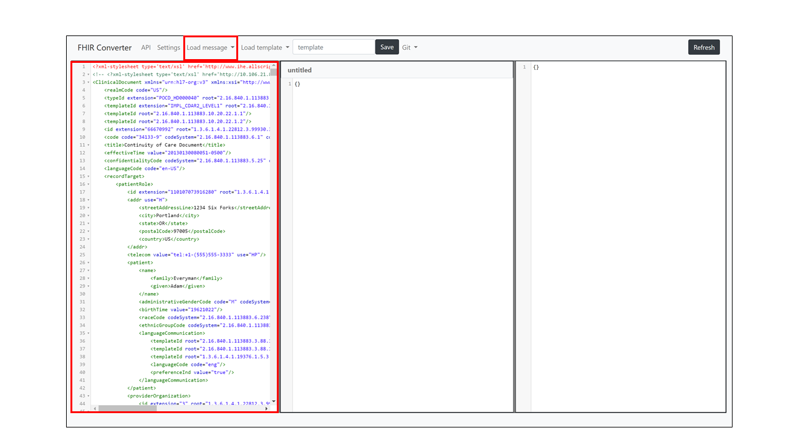
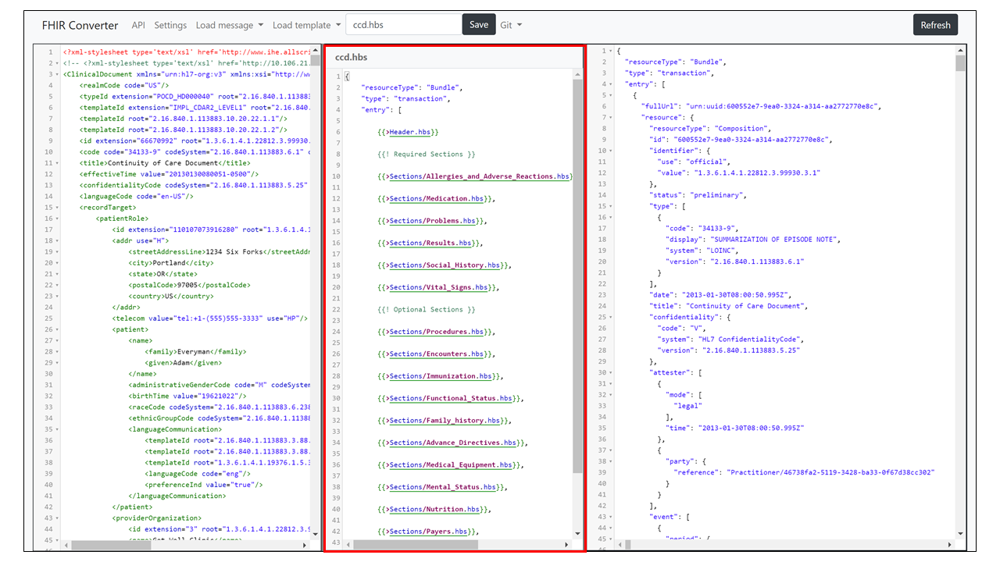
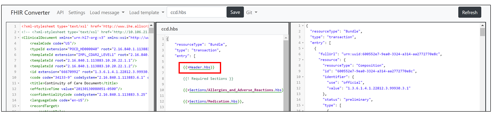

⚠ **This document applies to the Handlebars engine. Follow [this](https://github.com/microsoft/FHIR-Converter/tree/dotliquid) link for the documentation of Liquid engine.**   

# C-CDA template creation

In this how-to-guide, we will cover how to create templates for converting C-CDA documents into FHIR bundles. For more general guidance on creating templates, see the [Template Creation Guide](template-creation-how-to-guide.md). The C-CDA templates included in this release were generated based on the C-CDA and FHIR specifications and validated with customer examples.

Currently for C-CDA, we have top level templates for CCD, Consultation Note, Discharge Summary, History and Physical, Operative Note, Procedure Note, Progress Note, Referral Note and Transfer Summary. There are partial templates available for Data Types, Resources, References, Sections, Utils and Value Sets. For more information on these types of partial templates, see the [Partial Template Guide](partial-template-concept.md).

## Getting started

To get started updating/creating C-CDA templates:

1. Load or paste in the sample document that you are using to validate your template. When modifying and creating templates, it’s helpful to have your sample document loaded so that you are able to see the FHIR results real time as you’re editing.

2. Load your starting template or clear the template editing section. Rename the template and hit save so that your new template work doesn’t overwrite an existing template.

3. As you make updates in the middle editor, you will see the results of those reflected on the right-hand side.

**TIP**: When editing templates, auto-completion is available for common scenarios to help you pull in commands, helper functions, and template names. To pull these in, start with {{. If you need to pull a partial template, type {{>.

4. Once you are done editing, make sure to hit save. Your template will now be available to be called by the API for real time document translation.

## Tips for creating C-CDA templates

As part of the C-CDA converter release, we have provided partial templates for many of the sections found in various CCD documents. These partial templates are available under the Sections folder. We recommend taking advantage of these partial templates to construct your top level template. For example, in the ccd.hbs top level template, you can see partial templates both for the required sections and optional sections in the CCD document.

As part of the templates provided for the C-CDA converter, we have also included a Header.hbs partial template. The Header section is the root XML element and is present in every CDA document. It helps identify and classify documents via basic information about them. The Header.hbs partial template can be used in any top level template to convert the header section in a CDA document to FHIR.

For more details, see some of our additional conceptual guides and resources:

- [Template Creation Guide](template-creation-how-to-guide.md)
- [Partial template concept](partial-template-concept.md)
- [Helper function concept](using-helpers-concept.md)
- [List of helper functions](helper-function-summary.md)
- [Web UI functionality](web-ui-summary.md)
