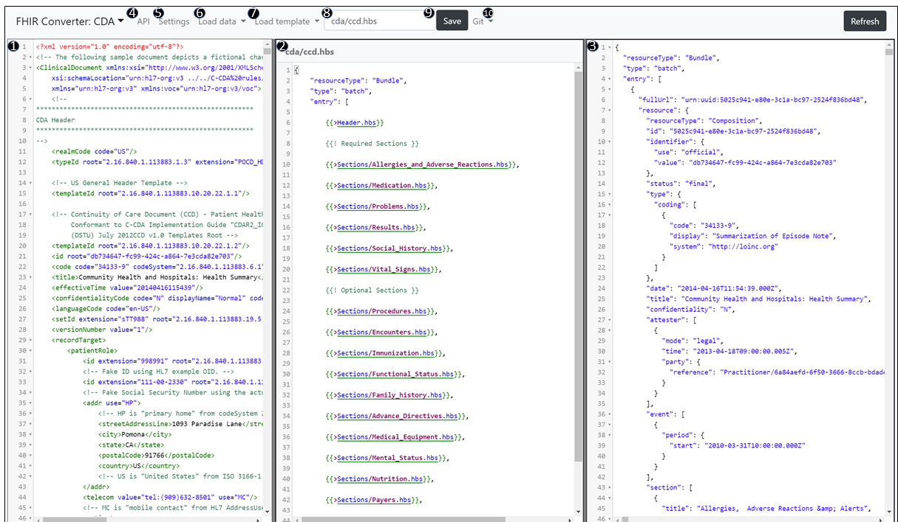

⚠ **This document applies to the Handlebars engine. Follow [this](https://github.com/microsoft/FHIR-Converter/tree/dotliquid) link for the documentation of Liquid engine.**   

# Web UI Summary

To edit templates, the open-source release includes a web UI. You can toggle between the HL7 v2 to FHIR editor and the C-CDA to FHIR editor:

The core functionality is consistent between the two editors, although there are some differences in the layout, which is described below.

## HL7 v2 Web UI Summary

Below is a screenshot of the HL7 v2 web UI with an overview of the key functionality.

| Area    | Name             | Overview of Functionality                                                                                                                                                                                                                                                                                                                                                         |
| ------- | ---------------- | --------------------------------------------------------------------------------------------------------------------------------------------------------------------------------------------------------------------------------------------------------------------------------------------------------------------------------------------------------------------------------- |
| 1       | Message Input    | Displays the HL7 v2 message being converted. You can paste in any HL7 v2 into the message box or load new messages into the sample messages to make them available in the drop down in #6                                                                                                                                                                                         |
| 2       | Display Template | json template based on selection in #7 and displayed in #8. The template can be edited in this window.                                                                                                                                                                                                                                                                            |
| 3       | FHIR Output      | FHIR bundle output of the message in #1 using the json template in #2                                                                                                                                                                                                                                                                                                             |
| 4       | API              | UI rendering of the swagger to see details on all available APIs. Note that this will navigate you way from the editor to a new page                                                                                                                                                                                                                                              |
| 5       | Settings         | Displays settings available in the UI. Currently the available setting is **dark mode** (off by default). This is also the pop-up you will see each time you access the UI from a new browser and where you will enter your API Key                                                                                                                                               |
| 6       | Load Message     | Location to select pre loaded test messages for testing the template and conversion                                                                                                                                                                                                                                                                                               |
| 7       | Load Template    | Location to select available templates                                                                                                                                                                                                                                                                                                                                            |
| 8       | Current Template | Shows which template is currently being displayed in #2 and allows you to rename templates for saving                                                                                                                                                                                                                                                                             |
| 9       | Save Template    | Allows you to save updates to the template being displayed in #2 and #8                                                                                                                                                                                                                                                                                                           |
| Refresh | Refresh          | Brings any updates that you made in a parallel session into this session. For example, if you have two sessions open side by side and modify a template in one, you won’t see the update in the other until selecting refresh. Note that refresh will not reload any open templates. To ensure you get all changes, close all open templates in the session and then hit refresh. |

## C-CDA Web UI Summary

Below is a screenshot of the C-CDA web UI with an overview of the key functionality.

| Area    | Name             | Overview of Functionality                                                                                                                                                                                                                                                                                                                                                         |
| ------- | ---------------- | --------------------------------------------------------------------------------------------------------------------------------------------------------------------------------------------------------------------------------------------------------------------------------------------------------------------------------------------------------------------------------- |
| 1       | Document Input   | Displays the CDA document being converted. You can paste in any CDA into the document box or load new documents into the sample documents to make them available in the drop down in #6                                                                                                                                                                                           |
| 2       | Display Template | json template based on selection in #7 and displayed in #8. The template can be edited in this window.                                                                                                                                                                                                                                                                            |
| 3       | FHIR Output      | FHIR bundle output of the document in #1 using the json template in #2                                                                                                                                                                                                                                                                                                            |
| 4       | API              | UI rendering of the swagger to see details on all available APIs. Note that this will navigate you way from the editor to a new page                                                                                                                                                                                                                                              |
| 5       | Settings         | Displays settings available in the UI. Currently the available setting is **dark mode** (off by default). This is also the pop-up you will see each time you access the UI from a new browser and where you will enter your API Key                                                                                                                                               |
| 6       | Load Data        | Location to select pre loaded test documents for testing the template and conversion                                                                                                                                                                                                                                                                                              |
| 7       | Load Template    | Location to select available templates                                                                                                                                                                                                                                                                                                                                            |
| 8       | Current Template | Shows which template is currently being displayed in #2 and allows you to rename templates for saving                                                                                                                                                                                                                                                                             |
| 9       | Save Template    | Allows you to save updates to the template being displayed in #2 and #8                                                                                                                                                                                                                                                                                                           |
| Refresh | Refresh          | Brings any updates that you made in a parallel session into this session. For example, if you have two sessions open side by side and modify a template in one, you won’t see the update in the other until selecting refresh. Note that refresh will not reload any open templates. To ensure you get all changes, close all open templates in the session and then hit refresh. |
